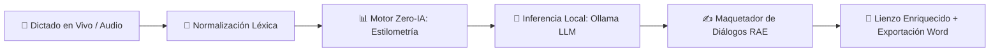

# 💎 Gema — Estación de Dictado y Asistente Literario Local

<p align="center">
  
  
  
  
  
  
  
  
</p>

<p align="center">
  <strong>El primer entorno de trabajo integral para escritores, novelistas y guionistas que transforma el habla espontánea en manuscritos literarios profesionales con ortotipografía RAE impecable, 100% privado y sin costes de API.</strong>
</p>

---

## 📖 Índice

- [Resumen Ejecutivo](#-resumen-ejecutivo)
- [¿Por qué Gema?](#-por-qué-gema)
- [Características Principales](#-características-principales)
- [Arquitectura del Sistema](#-arquitectura-del-sistema)
- [Requisitos Previos](#-requisitos-previos)
- [Inicio Rápido (3 Minutos)](#-inicio-rápido-3-minutos)
- [Estructura del Proyecto](#-estructura-del-proyecto)
- [Flujo de Trabajo del Escritor](#-flujo-de-trabajo-del-escritor)
- [Documentación Técnica Detallada](#-documentación-técnica-detallada)
- [Guía de Contribución](#-guía-de-contribución)
- [Licencia](#-licencia)

---

## 🌟 Resumen Ejecutivo

**Gema** no es un transcriptor genérico de audio ni una herramienta de dictado empresarial. Es una **estación de trabajo literaria completa (Local-First)** diseñada específicamente para resolver la fricción creativa entre pensar, hablar y plasmar prosa literaria de calidad de imprenta.

### Para el Escritor (Explicación General)
Cuando un autor dicta una novela o guion, su voz contiene dudas, muletillas (*"ehh"*, *"bueno"*), repeticiones y ritmo desordenado. Las herramientas convencionales transcriben esto literalmente como un bloque ilegible. 

Gema escucha tu voz y, en milisegundos:
1. **Limpia impurezas fonéticas**: Elimina muletillas sin alterar tu tono narrativo.
2. **Aplica formato ortotípico RAE**: Inserta las rayas de diálogo (`—`) con los incisos y verbos *dicendi* con la puntuación exacta de la Real Academia Española.
3. **Calibra tu voz autoral (ADN Literario)**: Ajusta la prosa a tu estilo o al de grandes autores (Hemingway, Raymond Chandler, Borges, Gabriel García Márquez).
4. **Analiza el pulso dramático**: Muestra gráficos de tensión narrativa, riqueza de vocabulario y ritmo silábico.
5. **Exporta a Word (.docx)**: Genera documentos con formato estándar de la industria editorial (Times New Roman 12pt, interlineado 1.5, sangría de 1.25 cm).
6. **Privacidad Absoluta**: **Cero datos van a la nube.** Todo funciona en tu ordenador de forma local y gratuita.

---

## ⚡ ¿Por qué Gema?

| Dimensión | Transcriptor Estándar (Whisper / Nube) | Procesador Word Tradicional | 💎 **Gema 2.0 Local** |
| :--- | :--- | :--- | :--- |
| **Privacidad** | Audio enviado a servidores de terceros | Local | **100% Soberano & Offline** |
| **Coste Operativo** | Pago recurrente por minuto / token | Licencia propietaria | **$0 / Sin APIs de pago** |
| **Diálogos en Español** | Comillas inglesas (`"..."`) o sin formato | Manual | **Rayas RAE automáticas (`—`)** |
| **Estilometría** | Ninguna | Conteo básico de palabras | **TTR, Fernández-Huerta, Tensión** |
| **Control de Versiones** | Historial simple de guardado | Básico | **Diff semántico con rollback visual** |
| **Latencia** | Variable según conexión | N/A | **Dictado en tiempo real en navegador** |

---

## 🚀 Características Principales



### 1. 🎙️ Ingesta de Audio Híbrida y Resiliente
- **Web Speech API**: Dictado instantáneo y continuo en el navegador con latencia sub-100ms.
- **Vosk ASR Offline**: Motor de reconocimiento de voz 100% offline mediante modelo acústico en español.
- **Filtro Espectral FFmpeg**: Conversión automática a 16kHz mono PCM con aislamiento de frecuencias vocales y **Modo Susurro** para dictado nocturno de bajo volumen.
- **WebSocket Streaming**: Transmisión bidireccional continua (`/api/v1/stream/{client_id}`).

### 2. 🧠 Motor Experto Zero-IA (Estilometría Computacional)
- **Riqueza Léxica (TTR - Type-Token Ratio)**: Detecta pobreza o exceso de repeticiones en vocabulario.
- **Legibilidad Fernández-Huerta**: Adaptación científica del índice Flesch para prosa en lengua castellana.
- **Segmentación de Frases Inteligente**: Uso de `pysbd` para respetar abreviaturas literarias (*Sr.*, *D.*, *etc.*) sin romper oraciones.
- **Cadencia y Conteo Silábico**: Detección de monotonía rítmica mediante `pyphen` y análisis de densidad adverbial/adjetival con `spaCy`.

### 3. 🧬 ADN Literario & Calibración de Tonos
- Carga de perfiles estilométricos calibrados:
  - **Hardboiled / Raymond Chandler**: Frases cortas, ritmo veloz, baja densidad adjetival.
  - **Fantasía Épica / Worldbuilding**: Vocabulario denso, cláusulas complejas.
  - **Realismo Mágico / García Márquez**: Cláusulas subordinadas, imaginería sensorial.
  - **Minimalismo / Hemingway**: Máxima economía verbal y corte directo.
- Extracción de huella autoral a partir de tus propios manuscritos previos.

### 4. 💬 Formateador Ortotípico RAE de Diálogos
Aplica estrictamente las directrices del *Diccionario panhispánico de dudas* y la *Ortografía de la lengua española*:
- Intervenciones abiertas con raya larga pegada al texto (`—Hola`).
- Incisos con verbos *dicendi* (*dijo*, *respondió*, *susurró*) forzados a minúscula y punto al final (`—Hola —dijo Juan.`).
- Incisos de acción pura con mayúscula y punto previo de la intervención (`—No quiero verte. —Se levantó de la silla.`).

### 5. 📉 Gráfico de Tensión Narrativa y Metadatos
- Algoritmo de análisis emocional que traza la curva de tensión dramática a lo largo de cada escena o capítulo.
- Extracción automática de sinopsis, tropos literarios, arquetipos de personajes y entidades clave.

### 6. 🛡️ Persistencia Dual y Control de Versiones
- **Cliente**: `IndexedDB` a través de `Dexie.js` para almacenamiento local instantáneo en el navegador con soporte offline completo.
- **Servidor**: Base de datos SQLite (`gema.db`) gestionada con `SQLAlchemy` y `Alembic`, junto con bóveda de archivos planos (`local_history_vault/`).
- **Diff Semántico Visual**: Comparación entre versiones del manuscrito basada en Google `diff-match-patch` con renderizado de adiciones y supresiones.

---

## 🏗️ Arquitectura del Sistema

El sistema implementa una **Arquitectura Limpia Hexagonal** desacoplada:

```
Grabadora_para_Escritores/
├── frontend/                      # Cliente Next.js 16 + React 19 + TipTap
│   ├── src/
│   │   ├── app/                   # App Router y rutas API de exportación
│   │   ├── components/            # Lienzo TipTap, paneles, gráficos, inspectores
│   │   ├── hooks/                 # useAudioUpload, useAutoSave, useManuscriptAnalytics
│   │   ├── infrastructure/        # Adaptadores Web Speech, IndexedDB Dexie, Export DOCX
│   │   ├── layouts/               # TriplePanelLayout (Explorador / Lienzo / Análisis)
│   │   └── store/                 # Zustand Stores (Dictation, History, Project, Tone)
│
├── backend/                       # Motor FastAPI (Python 3.12+)
│   ├── api/v1/endpoints/          # Controladores REST (Audio, Style, Docs, Tones, DNA...)
│   ├── api/v1/websocket/          # Streaming en tiempo real
│   ├── services/
│   │   ├── analytics/             # Fábricas y procesadores de métricas
│   │   ├── audio/                 # FFmpeg procesador y filtros espectrales
│   │   ├── export/                # Exportadores DOCX según normas editoriales RAE
│   │   ├── history/               # Repositorios y orquestador de snapshots/diffs
│   │   ├── infrastructure/        # Orquestador local, monitor de hardware, resiliencia
│   │   ├── nlp/                   # spaCy, pipeline de refinamiento, adaptador Ollama, RAE
│   │   └── transcription/         # Orquestador Vosk ASR y workers de fondo
│   ├── database.py                # Conexión SQLite y sesiones
│   ├── models.py                  # Modelos relacionales SQLAlchemy
│   └── tests/                     # Suite de 35 tests automatizados (pytest)
│
├── docs/                          # Documentación técnica y guías de usuario
│   ├── ARCHITECTURE.md            # Diagramas y especificación técnica
│   ├── API_REFERENCE.md           # Catálogo OpenAPI REST y WebSocket
│   ├── MANUAL_USUARIO.md          # Manual ilustrado para escritores
│   └── DEVELOPMENT_GUIDE.md       # Guía de contribución y setup dev
```

---

## 📋 Requisitos Previos

1. **Python**: Versión 3.12 o superior.
2. **Node.js**: Versión 18.0 o superior (con `npm`).
3. **FFmpeg**: Instalado en el sistema y accesible desde el `PATH`.
   - *Windows*: `winget install Gyan.FFmpeg`
   - *macOS*: `brew install ffmpeg`
   - *Ubuntu/Debian*: `sudo apt install ffmpeg`
4. **Ollama** (Opcional pero recomendado para refinamiento por IA local):
   - Descarga desde [ollama.com](https://ollama.com) y ejecuta `ollama pull llama3` (o `mistral`).

---

## ⚡ Inicio Rápido (3 Minutos)

### Opción A: Script Automático (Recomendado)

#### En Windows (PowerShell):
```powershell
./run_gema.ps1
```

#### En Linux / macOS (Bash):
```bash
chmod +x run_gema.sh
./run_gema.sh
```

El script verificará dependencias, iniciará el backend en `http://localhost:8000`, el frontend en `http://localhost:3000` y comprobará Ollama.

---

### Opción B: Arranque Manual

#### 1. Clonar el Repositorio
```bash
git clone https://github.com/MaciasSM2/Transcribir_para_Escritores.git
cd Transcribir_para_Escritores
```

#### 2. Configurar e Iniciar Backend
```bash
cd backend
python -m venv venv

# Activar entorno virtual
# En Windows:
.\venv\Scripts\activate
# En Linux/macOS:
source venv/bin/activate

pip install -r requirements.txt
python -m spacy download es_core_news_sm
uvicorn main:app --reload --port 8000
```

#### 3. Configurar e Iniciar Frontend
En una nueva terminal:
```bash
cd frontend
npm install
npm run dev
```

Abre **`http://localhost:3000`** en tu navegador Chrome, Edge o Firefox.

---

## 📊 Flujo de Trabajo del Escritor

1. **Seleccionar o Crear Escena**: Usa el *Panel Izquierdo (Explorador de Capítulos)* para organizar la estructura de tu obra.
2. **Elegir Tono Literario**: Selecciona el tono deseado (*General*, *Ciencia Ficción*, *Noir*, *García Márquez*, etc.) en la barra superior.
3. **Dictar**:
   - Presiona el botón del micrófono para dictado en directo.
   - O arrastra un archivo de audio (`.mp3`, `.wav`, `.m4a`, `.ogg`) grabado en tu teléfono o grabadora.
4. **Refinar con 1 Clic**: El motor aplica limpieza léxica, formato ortotípico RAE y enriquecimiento estilístico.
5. **Revisar Métricas**: Consulta en el *Panel Derecho* la legibilidad, riqueza léxica y gráfico de tensión de la escena.
6. **Exportar Manuscrito**: Haz clic en *Exportar $\to$ DOCX Editorial (RAE)* para obtener el archivo listo para enviar a imprenta o certamen literario.

---

## 📚 Documentación Técnica Detallada

- 📘 [**Manual de Usuario para Escritores**](docs/MANUAL_USUARIO.md): Guía paso a paso sin tecnicismos para sacar el máximo partido a Gema.
- 📐 [**Documento de Arquitectura**](docs/ARCHITECTURE.md): Diagramas de capas, pipelines de inferencia, gestión de memoria y resiliencia.
- 🔌 [**Referencia de API (REST & WebSocket)**](docs/API_REFERENCE.md): Contratos OpenAPI, modelos Pydantic y ejemplos de peticiones.
- 🛠️ [**Guía de Desarrollo**](docs/DEVELOPMENT_GUIDE.md): Entorno de testing, estándares de código, migraciones Alembic y flujos de PR.

---

## 🧪 Pruebas Automatizadas

El proyecto cuenta con suites de validación completas en frontend y backend:

```bash
# Backend: Ejecutar 35 tests unitarios y de integración
cd backend
pytest -v

# Frontend: Validación estricta de TypeScript y compilación Next.js
cd frontend
npm run build
```

---

## 🤝 Guía de Contribución

¡Las contribuciones son bienvenidas! Por favor, consulta [CONTRIBUTING.md](CONTRIBUTING.md) para conocer las pautas de estilo de código, convenciones de commit (Conventional Commits) y el flujo de trabajo de pull requests.

---

## 📄 Licencia

Este proyecto está bajo la Licencia MIT. Consulta el archivo [LICENSE](LICENSE) para más detalles.

---

<p align="center">
  Hecho con ❤️ para escritores que aman contar historias con su propia voz.
</p>
