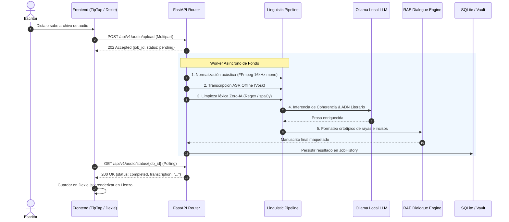
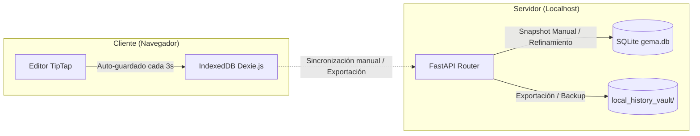

# 📐 Documento de Arquitectura Técnica del Sistema — Gema 2.0

Este documento describe la arquitectura de software, patrones de diseño, flujos de datos y subsistemas de **Gema (Grabadora para Escritores)**.

---

## 📑 Tabla de Contenidos

1. [Principios de Diseño y Filosofía Arquitectónica](#1-principios-de-diseño-y-filosofía-arquitectónica)
2. [Diagrama de Arquitectura Hexagonal](#2-diagrama-de-arquitectura-hexagonal)
3. [Pipeline de Procesamiento de Audio y Texto](#3-pipeline-de-procesamiento-de-audio-y-texto)
4. [Subsistemas del Backend (FastAPI + Python)](#4-subsistemas-del-backend-fastapi--python)
   - [4.1 Motor ASR & Filtrado Espectral](#41-motor-asr--filtrado-espectral)
   - [4.2 Motor Experto Zero-IA (Estilometría)](#42-motor-experto-zero-ia-estilometría)
   - [4.3 Adaptador de Inferencia Local (Ollama)](#43-adaptador-de-inferencia-local-ollama)
   - [4.4 Formateador Ortotípico RAE de Diálogos](#44-formateador-ortotípico-rae-de-diálogos)
   - [4.5 Guardián de Resiliencia y Hardware](#45-guardián-de-resiliencia-y-hardware)
5. [Subsistemas del Frontend (Next.js 16 + React 19)](#5-subsistemas-del-frontend-nextjs-16--react-19)
   - [5.1 Lienzo Enriquecido TipTap](#51-lienzo-enriquecido-tiptap)
   - [5.2 Gestión de Estado con Zustand](#52-gestión-de-estado-con-zustand)
   - [5.3 Persistencia Offline con Dexie.js (IndexedDB)](#53-persistencia-offline-con-dexiejs-indexeddb)
6. [Estrategia de Persistencia Dual y Control de Versiones](#6-estrategia-de-persistencia-dual-y-control-de-versiones)
7. [Manejo de Errores y Degradación Elegante](#7-manejo-de-errores-y-degradación-elegante)

---

## 1. Principios de Diseño y Filosofía Arquitectónica

Gema se rige por cuatro principios fundamentales:

1. **Soberanía y Local-First**: Ningún dato de audio, transcripción o manuscrito depende de conexiones a servicios externos en la nube. Todo el stack opera en el host local.
2. **Arquitectura Hexagonal (Ports & Adapters)**: Separación estricta entre modelos de dominio (`services/`), puertos de entrada (`api/v1/endpoints/`), adaptadores de infraestructura (`services/infrastructure/`, `services/audio/`) y almacenamiento (`database.py`, `models.py`).
3. **Dualidad Heurística + LLM**: Las operaciones determinísticas (limpieza de muletillas, conteo silábico, métricas TTR, reglas de diálogos) se ejecutan con algoritmos O(1)/O(N) sin coste computacional. Los LLMs locales solo se invocan para enriquecimiento semántico y coherencia de estilo.
4. **Resiliencia y Concurrencia Protegida**: Los recursos locales (GPU/VRAM y CPU) están protegidos mediante semáforos asíncronos (`asyncio.Semaphore(1)`), fragmentación por lotes de textos largos y workers en segundo plano.

---

## 2. Diagrama de Arquitectura Hexagonal

```mermaid
graph TB
    subgraph "Capa de Presentación (Frontend - Next.js 16)"
        UI[Triple Panel Layout]
        Editor[Lienzo TipTap Editor]
        Stores[Zustand State Stores]
        DexieDB[(IndexedDB / Dexie.js)]
        SpeechRec[Web Speech Adapter]
        UI --> Editor
        UI --> Stores
        Stores <--> DexieDB
        SpeechRec --> Stores
    end

    subgraph "Capa de Adaptadores Primarios (API REST & WS)"
        Router[FastAPI API Router v1]
        AudioEndpoint[/api/v1/audio]
        StyleEndpoint[/api/v1/style]
        DocsEndpoint[/api/v1/docs]
        TonesEndpoint[/api/v1/tones]
        DNAEndpoint[/api/v1/dna]
        HistoryEndpoint[/api/v1/history]
        StreamEndpoint[WebSocket /stream]
    end

    subgraph "Capa de Dominio & Servicios (Core)"
        RefinePipe[Linguistic Refinement Pipeline]
        StyleAnalyzer[Stylometry & Readability Analyzer]
        RaeFormatter[RAE Dialogue Formatter]
        ResilienceMgr[Resilience & Chunking Manager]
        SnapOrch[Snapshot Orchestrator]
    end

    subgraph "Capa de Adaptadores Secundarios (Infraestructura)"
        FFmpeg[FFmpeg Spectral Processor]
        VoskASR[Vosk Speech Recognition Engine]
        OllamaAdapter[Ollama Coherence Adapter]
        DiffEngine[diff-match-patch Engine]
        DocxExporter[DOCX RAE Exporter]
        SQLiteDB[(SQLite gema.db)]
        Vault[(Disk File Vault)]
    end

    Editor <-->|HTTP REST / WS| Router
    Router --> AudioEndpoint & StyleEndpoint & DocsEndpoint & TonesEndpoint & DNAEndpoint & HistoryEndpoint & StreamEndpoint

    AudioEndpoint --> FFmpeg --> VoskASR --> RefinePipe
    StyleEndpoint --> StyleAnalyzer & RefinePipe
    RefinePipe --> RaeFormatter
    RefinePipe --> OllamaAdapter
    HistoryEndpoint --> DiffEngine
    DocsEndpoint --> DocxExporter & SQLiteDB & Vault
    SnapOrch --> SQLiteDB
```

---

## 3. Pipeline de Procesamiento de Audio y Texto

El pipeline de refinamiento se ejecuta en fases secuenciales optimizadas:



---

## 4. Subsistemas del Backend (FastAPI + Python)

### 4.1 Motor ASR & Filtrado Espectral (`services/audio/` & `services/transcription/`)
- **`FFmpegAudioProcessor`**: Sanitiza y convierte cualquier formato contenedor (`.mp3`, `.m4a`, `.ogg`, `.flac`) a `wav` 16kHz, 16-bit mono. Aplica filtros de paso alto/bajo para aislar frecuencias de la voz humana y un filtro de volumen dinámico para el **Modo Susurro**.
- **`TranscriptionEngine`**: Envuelve el reconocedor acústico offline Vosk, operando sin conexión a internet y consumiendo directamente los buffers generados por FFmpeg.

### 4.2 Motor Experto Zero-IA (`services/style_analyzer.py` & `services/nlp/`)
- **`TextCleaner`**: Motor regex determinista de ultra-alta velocidad (< 1ms) que elimina titubeos, muletillas y falsos comienzos antes de cualquier llamada al LLM.
- **`StyleAnalyzer`**: Mide:
  - **Fernández-Huerta**: $206.84 - (0.60 \times P) - (1.02 \times F)$, donde $P$ es el número de sílabas por cada 100 palabras y $F$ el número de frases por cada 100 palabras.
  - **Riqueza Léxica (TTR)**: $\text{TTR} = \frac{\text{Vocabulario Único}}{\text{Total de Palabras}}$.
  - **Densidad Morfosintáctica**: Extrae la proporción de adjetivos, adverbios y verbos mediante el modelo lingüístico `es_core_news_sm` de spaCy.

### 4.3 Adaptador de Inferencia Local (`services/nlp/ollama_adapter.py`)
- Gestiona la comunicación HTTP con el demonio local de Ollama.
- **`_semaphore = asyncio.Semaphore(1)`**: Garantiza que únicamente se ejecute una inferencia pesada a la vez, impidiendo la saturación de VRAM/RAM en ordenadores con GPUs dedicadas modestas o gráficos integrados.
- Si Ollama no está disponible o la petición sufre un timeout (>45s), el adaptador efectúa una **degradación elegante** retornando el texto limpio generado por el motor Zero-IA sin interrumpir la experiencia del usuario.

### 4.4 Formateador Ortotípico RAE de Diálogos (`services/nlp/dialogue_formatter.py`)
- Aplica las complejas reglas tipográficas de la RAE:
  - Verbos *dicendi* (*dijo*, *respondió*, *replicó*, *exclamó*, *preguntó*, etc.): Forzados a minúscula inicial tras la raya de inciso.
  - Incisos de acción pura: Cierre de punto antes de la raya y mayúscula en la acción.
  - Supresión de comillas angulares o inglesas en diálogos teatrales o novelescos.

### 4.5 Guardián de Resiliencia y Hardware (`services/infrastructure/`)
- **`LocalEnvironmentOrchestrator`**: Ejecuta auditorías pre-vuelo no bloqueantes de dependencias críticas (FFmpeg, modelos Vosk, demonio Ollama).
- **`SystemGuardian`**: Monitorea el uso de CPU y memoria RAM del host mediante `psutil` para alertar al usuario si el sistema corre riesgo de degradación por falta de memoria (Out-Of-Memory).

---

## 5. Subsistemas del Frontend (Next.js 16 + React 19)

### 5.1 Lienzo Enriquecido TipTap (`components/Editor/RichCanvas.tsx`)
- Editor visual WYSIWYG configurado para simular un folio editorial A4.
- Extensiones TipTap personalizadas para soporte de atajos de teclado de escritor (`Ctrl+B`, `Ctrl+I`, `Ctrl+Shift+D` para raya de diálogo).
- Menú burbuja contextual para reescritura rápida de párrafos y consulta de sinónimos.

### 5.2 Gestión de Estado con Zustand (`store/`)
- **`useDictationStore`**: Gestiona el texto actual, estado del micrófono, búfer en vivo y alertas de estilo activas.
- **`useProjectStore`**: Administra la jerarquía de capítulos, escenas, títulos y navegación entre documentos.
- **`useToneStore`**: Almacena el tono literario seleccionado y el texto de referencia persistido.
- **`useHistoryStore`**: Gestiona el historial de snapshots y las peticiones de comparación de diffs.
- **`useInferenceStore`**: Controla el estado del worker de fondo, barras de progreso y respuestas asíncronas.

### 5.3 Persistencia Offline con Dexie.js (`infrastructure/storage/LocalPersistenceService.ts`)
- Utiliza **IndexedDB** en el navegador para que el usuario pueda escribir, crear escenas y consultar su obra incluso si el backend o la conexión de red se detienen temporalmente.

---

## 6. Estrategia de Persistencia Dual y Control de Versiones



1. **Auto-guardado local (Latencia Cero)**: El hook `useAutoSave` persiste en IndexedDB cada cambio en tiempo real.
2. **Snapshots de Versión**: Almacenados en la tabla `snapshots` de SQLite con numeración incremental por capítulo.
3. **Diff Semántico Visual**: El backend calcula deltas con `diff-match-patch`, procesa la limpieza semántica de diferencias y devuelve el HTML enriquecido listo para renderizado visual.

---

## 7. Manejo de Errores y Degradación Elegante

| Componente Afectado | Escenario de Fallo | Comportamiento del Sistema |
| :--- | :--- | :--- |
| **Ollama Daemon** | No está iniciado o no responde | El sistema conmuta automáticamente al **Motor Zero-IA** (limpieza léxica + reglas RAE sin IA) y notifica al usuario con un badge informativo. |
| **Vosk ASR** | Modelo acústico no descargado | Se utiliza **Web Speech API** del navegador como motor de dictado primario. |
| **FFmpeg** | No instalado en el PATH | El dictado en directo sigue operativo vía Web Speech; se deshabilita la conversión de audios subidos hasta su instalación. |
| **Hardware** | Consumo de RAM > 90% | El orquestador fragmenta automáticamente textos largos en bloques pequeños para evitar bloqueos del sistema operativo. |
